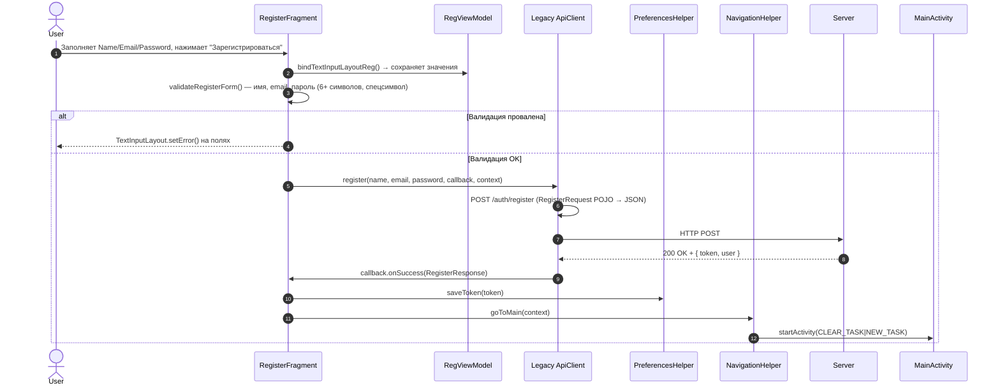
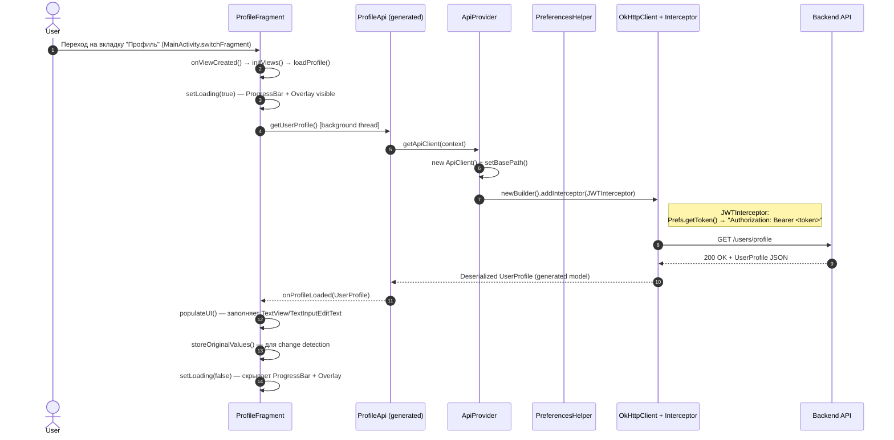
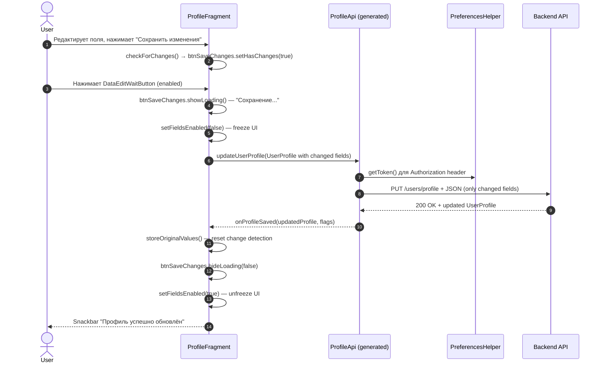
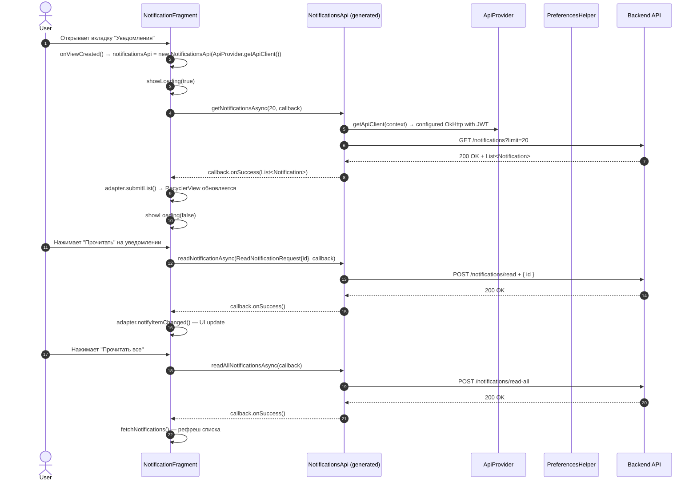

# Архитектура приложения "Лагерь-Вожатый"

> Версия документа: 1.0 | Дата: 2025-08-27  
> Проект: CAMPUS2 (Android, Java, XML)  
> Стек: Java 17, Android SDK 34, OkHttp 4.x, Gson, OpenAPI Generator 7.10, Material Components 1.12

---

## 1. Пользовательский интерфейс (UI Flow)

*Описание: Как пользователь переходит между экранами. Только пользовательские сценарии — без технических деталей.*

```mermaid
graph TD
    %% Entry point
    Start([App Launch]) --> AuthCheck{Token in<br/>SharedPreferences?}
    
    %% Auth Flow
    AuthCheck -- No --> AuthActivity[AuthActivity]
    AuthActivity --> LoginFragment[LoginFragment]
    AuthActivity --> RegisterFragment[RegisterFragment]
    
    LoginFragment -- "Switch" --> RegisterFragment
    RegisterFragment -- "Switch" --> LoginFragment
    
    LoginFragment -- "Login Success" --> MainActivity[MainActivity]
    RegisterFragment -- "Register Success" --> MainActivity
    
    AuthCheck -- Yes --> MainActivity
    
    %% Main Navigation
    MainActivity --> BottomNav[BottomNavigationView]
    BottomNav --> SquadFragment[SquadFragment<br/>"Отряд"]
    BottomNav --> NotificationsFragment[NotificationsFragment<br/>"Уведомления"]
    BottomNav --> MapFragment[MapFragment<br/>"Карта"]
    BottomNav --> SquadLogFragment[SquadLogFragment<br/>"Журнал отряда"]
    BottomNav --> ProfileFragment[ProfileFragment<br/>"Профиль"]
    
    %% Profile interactions
    ProfileFragment -- "Change Password" --> ChangePasswordDialog[ChangePasswordDialog]
    ProfileFragment -- "Logout" --> AuthActivity
    ProfileFragment -- "Save Notes" --> EditNotesDialog[Edit Notes Dialog]
    
    %% Notifications interactions
    NotificationsFragment -- "Mark as Read" --> NotificationsFragment
    NotificationsFragment -- "Read All" --> NotificationsFragment
    
    %% Squad interactions (planned)
    SquadFragment -- "Child Card" --> ChildDetailDialog[Child Detail Dialog]
    SquadFragment -- "Copy Icon" --> EditNotesDialog
    
    %% Styling
    classDef activity fill:#e3f2fd,stroke:#1565c0,stroke-width:2px
    classDef fragment fill:#f3e5f5,stroke:#7b1fa2,stroke-width:1px
    classDef dialog fill:#fff3e0,stroke:#ef6c00,stroke-width:1px,stroke-dasharray: 5 5
    classDef decision fill:#fff9c4,stroke:#fbc02d,stroke-width:2px
    
    class AuthActivity,MainActivity activity
    class LoginFragment,RegisterFragment,SquadFragment,NotificationsFragment,MapFragment,SquadLogFragment,ProfileFragment fragment
    class ChangePasswordDialog,EditNotesDialog,ChildDetailDialog dialog
    class AuthCheck decision
```

### Экраны и их назначение

| Экран | Класс | Роль | Ключевые UI-элементы |
|-------|-------|------|---------------------|
| **AuthActivity** | `AuthActivity` | Контейнер для авторизации | `FrameLayout` (fragment_container), кнопки переключения Login/Register |
| **LoginFragment** | `LoginFragment` | Форма входа | Email, Password, MaterialButton "Войти", TextInputLayout с валидацией |
| **RegisterFragment** | `RegisterFragment` | Форма регистрации | Name, Email, Password, MaterialButton "Зарегистрироваться", спецсимвол в пароле |
| **MainActivity** | `MainActivity` | Главный контейнер после входа | BottomNavigationView (5 вкладок), FrameLayout для фрагментов, Jesus saying |
| **SquadFragment** | `SquadFragment` | Список детей в отряде | RecyclerView, карточки детей (ФИО, возраст, родитель, теги, заметки) |
| **NotificationsFragment** | `NotificationFragment` | Список уведомлений | RecyclerView, ProgressBar, кнопка "Прочитать все", счетчик непрочитанных |
| **MapFragment** | `MapFragment` | Карта (заглушка) | WebView / MapView (в разработке) |
| **SquadLogFragment** | `SquadLogFragment` | Журнал отряда (заглушка) | RecyclerView с логами (в разработке) |
| **ProfileFragment** | `ProfileFragment` | Профиль вожатого | CircleImageView, поля ФИО/Email/Телефон, DataEditWaitButton, смена пароля, выход |

### Состояния экранов (State Matrix)

| Экран | Empty | Loading | Content | Error | Offline |
|-------|-------|---------|---------|-------|---------|
| Login/Register | — | Button disabled | Form ready | Inline field errors + Snackbar | Snackbar "Нет сети" |
| SquadFragment | "Вожатый не привязан к отряду" | ProgressBar + Overlay | RecyclerView с детьми | Snackbar + Retry | Кэш / Snackbar |
| NotificationsFragment | "Нет уведомлений" | ProgressBar + Overlay | Список | Snackbar | Кэш |
| ProfileFragment | — | ProgressBar + Overlay | Заполненные поля | Snackbar + Retry | — |

---

## 2. Потоки данных и архитектура (Data Flow)

*Описание: Как экраны общаются с сервером. Два подхода: **Legacy** (свой `ApiClient` + POJO) для Auth и **Modern** (OpenAPI-generated) для остального.*

### 2.1. Общая схема слоёв

```
┌─────────────────────────────────────────────────────────────────┐
│                        UI LAYER (Fragments)                     │
│  LoginFragment • RegisterFragment • ProfileFragment • ...       │
└──────────────────────────┬──────────────────────────────────────┘
                           │ callbacks / listeners
                           ▼
┌─────────────────────────────────────────────────────────────────┐
│                      REPOSITORY / API LAYER                     │
│  ┌──────────────────────────┐  ┌────────────────────────────┐  │
│  │   LEGACY ApiClient       │  │   MODERN OpenAPI Client    │  │
│  │   (helpers/ApiClient)    │  │   (generated/api/*)        │  │
│  │   • login()              │  │   • ProfileApi             │  │
│  │   • register()           │  │   • NotificationsApi       │  │
│  │   • getUser()            │  │   • SquadsApi              │  │
│  │   • isTokenValid()       │  │   • ChildrenApi            │  │
│  │   • post()/get()         │  │   • ApiProvider (config)   │  │
│  └──────────────┬───────────┘  └──────────────┬─────────────┘  │
│                 │                             │                │
│                 ▼                             ▼                │
│  ┌──────────────────────────────────────────────────────────┐  │
│  │              NETWORK (OkHttp + Interceptors)              │  │
│  │  • Base URL: http://localhost:3000/api/v1                 │  │
│  │  • Auth: Bearer JWT в Authorization header                │  │
│  │  • Logging: HttpLoggingInterceptor (HEADERS)              │  │
│  └──────────────────────────────────────────────────────────┘  │
└──────────────────────────┬──────────────────────────────────────┘
                           │
                           ▼
┌─────────────────────────────────────────────────────────────────┐
│                      STORAGE LAYER                              │
│  PreferencesHelper (SharedPreferences "AppPrefs")               │
│  • jwt_token          — Bearer токен                            │
│  • Jesus_says         — Цитата для главного экрана              │
└─────────────────────────────────────────────────────────────────┘
```

### 2.2. Sequence Diagram: Авторизация (Legacy ApiClient)


**Endpoints (Legacy):**
- `POST /auth/login` → `LoginResponse { token, user }`
- `POST /auth/register` → `RegisterResponse { token, user }`
- `GET /auth/verify-jwt` → `VerifyJWTResponse { valid: boolean }`
- `GET /users/profile/{userId}` → `User` (from JWT payload)

### 2.3. Sequence Diagram: Регистрация (Legacy ApiClient)



### 2.4. Sequence Diagram: Загрузка профиля (Modern OpenAPI)



**Endpoints (Modern OpenAPI):**
- `GET /users/profile` → `UserProfile { id, fullName, email, phoneNumber, role, avatar, squad }`
- `PUT /users/profile` → `UserProfile` (partial update — только изменённые поля)
- `GET /squads/{squadId}/children` → `List<Child>`
- `GET /notifications` → `List<Notification>`
- `POST /notifications/read` → `ReadNotificationResponse`
- `POST /notifications/read-all` → `ReadAllNotifications200Response`

### 2.5. Sequence Diagram: Сохранение профиля (Modern OpenAPI)



### 2.6. Sequence Diagram: Уведомления (Modern OpenAPI)



### 2.7. Обработка ошибок (Error Handling Strategy)

| Слой | Стратегия | Пример |
|------|-----------|--------|
| **Network** | Interceptor добавляет токен; при 401 — не редиректит автоматически (пусть UI решит) | `ApiProvider` interceptor логирует, но не выбрасывает исключение |
| **API Client (Legacy)** | `ApiCallback.onFailure(String errorMessage)` — единая строка для UI | `ViewUtils.toast(view, context, errorMessage)` |
| **API Client (Modern)** | `ApiCallback.onFailure(ApiException e, int statusCode, Map headers)` — полный контекст | `statusCode == 401` → `NavigationHelper.goToAuth()` |
| **UI** | Snackbar для временных ошибок; Toast для критических; инлайн ошибки для форм | `TextInputLayout.setError()` для валидации |
| **Token Expiry** | Проверка в `MainActivity.onCreate` + `AuthActivity.onCreate` через `PreferencesHelper.isTokenSet()` | При 401 в современных вызовах — `goToAuth()` |

---

## 3. Вспомогательные классы (Helpers & Utilities)

*Описание: Справочная таблица всех утилит. Это инструменты, а не бизнес-сущности.*

| Класс | Назначение | Где используется | Пример вызова | Ключевые методы |
|-------|------------|------------------|---------------|-----------------|
| **PreferencesHelper** | Абстракция над `SharedPreferences` для JWT и настроек. Хранит токен, декодирует JWT payload. | `AuthActivity`, `LoginFragment`, `RegisterFragment`, `MainActivity`, `ProfileFragment`, `ApiProvider`, `Legacy ApiClient` | `new PreferencesHelper(context).saveToken(token)`<br/>`prefs.getToken()`<br/>`prefs.decodePayload()` → `JSONObject` | `saveToken(String)`<br/>`getToken(): String`<br/>`isTokenSet(): Boolean`<br/>`clear()`<br/>`decodePayload(): JSONObject`<br/>`saveJesusSaying(String)` / `getJesusSaying()` |
| **ViewUtils** | UI-утилиты: тосты (Snackbar), биндинг TextInputLayout→ViewModel, скругление кнопок, цвет фона. | `LoginFragment`, `RegisterFragment`, `ProfileFragment`, `NotificationFragment`, все фрагменты | `ViewUtils.toast(view, context, "Текст")`<br/>`ViewUtils.bindTextInputLayoutAuth(layout, viewModel, "email")`<br/>`ViewUtils.setButtonCornerRadius(btn, 14)`<br/>`ViewUtils.setBGColor(view, Color.WHITE)` | `toast(View, Context, String)`<br/>`setButtonCornerRadius(MaterialButton, float)`<br/>`setBGColor(View, int)`<br/>`bindTextInputLayoutAuth(TextInputLayout, AuthViewModel, String)`<br/>`bindTextInputLayoutReg(TextInputLayout, RegViewModel, String)`<br/>`dpToPx(float): int` |
| **NavigationHelper** | Навигация между Activity с очисткой бэк-стека (FLAG_ACTIVITY_CLEAR_TASK \| NEW_TASK). | `LoginFragment`, `RegisterFragment`, `ProfileFragment`, `MainActivity`, `AuthActivity` | `NavigationHelper.goToMain(context)`<br/>`NavigationHelper.goToAuth(context)` | `goToMain(Context)` — запускает `MainActivity`<br/>`goToAuth(Context)` — запускает `AuthActivity` |
| **ApiProvider** | Фабрика для современного OpenAPI клиента. Создаёт `ApiClient` с базовым URL и JWT-интерцептором. Одиночка (singleton). | `ProfileFragment`, `NotificationFragment`, будущие фрагменты (Squad, Map, SquadLog) | `ApiProvider.getApiClient(context)` → `ApiClient`<br/>`new ProfileApi(ApiProvider.getApiClient(context))` | `getApiClient(Context): ApiClient`<br/>`getApiClient(): ApiClient` (без контекста — без токена) |
| **Legacy ApiClient** | Старый самописный клиент на OkHttp + Gson. Используется **только** для Auth endpoints (`/auth/login`, `/auth/register`, `/auth/verify-jwt`, `/users/profile/{id}`). Синглтон. | `LoginFragment`, `RegisterFragment`, `AuthActivity` (закомментировано) | `ApiClient.getInstance().login(email, pass, callback, context)`<br/>`ApiClient.getInstance().register(name, email, pass, callback, context)`<br/>`ApiClient.getInstance().getUser(view, context, callback)` | `login(String, String, ApiCallback<LoginResponse>, Context)`<br/>`register(String, String, String, ApiCallback<RegisterResponse>, Context)`<br/>`post/get/getWithParams` — generic HTTP<br/>`isTokenValid(View, Context): boolean` (async, но возвращает сразу — **баг**)<br/>`getUser(View, Context, ApiCallback<User>)` |
| **DataCallback** | Универсальный колбэк для репозиториев (success/error). Используется в `ProfileFragment` для единообразия. | `ProfileFragment` (внутренне), будущие Repository классы | `new DataCallback<UserProfile>() { onSuccess(data), onError(err) }` | `onSuccess(T data)`<br/>`onError(String error)` |
| **AuthViewModel / RegViewModel** | `ViewModel` для сохранения ввода при ротации экрана / переключении фрагментов внутри `AuthActivity`. | `LoginFragment`, `RegisterFragment` | `new ViewModelProvider(requireActivity()).get(AuthViewModel.class)`<br/>`viewModel.setEmail(value)`<br/>`viewModel.getEmail().getValue()` | `setEmail/getEmail`: `MutableLiveData<String>`<br/>`setPassword/getPassword`<br/>`setName/getName` (RegViewModel) |

---

## 4. Сравнение двух подходов к API

| Аспект | Legacy ApiClient (`helpers/ApiClient.java`) | Modern OpenAPI (`generated/`) |
|--------|--------------------------------------------|-------------------------------|
| **Генерация** | Ручной код | `openApiGenerate` Gradle task из `swagger.yaml` |
| **Модели** | POJO в `models/server_requests`, `models/server_responses` | Generated в `generated/model/*` (Immutable, Builder pattern) |
| **API Интерфейсы** | Методы в классе `ApiClient` | Отдельные интерфейсы: `ProfileApi`, `NotificationsApi`, `SquadsApi`, `ChildrenApi`, `AuthApi` |
| **Аутентификация** | Ручной `addHeader("Authorization", "Bearer " + token)` в каждом запросе | Интерцептор в `ApiProvider` — автоматически подхватывает токен из `PreferencesHelper` |
| **Колбэки** | `ApiCallback<T> { onSuccess(T), onFailure(String) }` | `ApiCallback<T> { onSuccess(T, int, Map), onFailure(ApiException, int, Map) }` |
| **Асинхронность** | `enqueue()` + callback на главном потоке | `...Async()` методы + callback |
| **Использование** | **Auth**: Login, Register, Verify JWT, GetUser (by ID from JWT) | **Всё остальное**: Profile, Notifications, Squads, Children, Events, Tags, Map |
| **Статус** | Deprecated для новых экранов; поддерживается для совместимости | Основной путь развития |

> **Миграция**: Новые экраны (SquadFragment, MapFragment, SquadLogFragment) должны использовать Modern подход через `ApiProvider` + соответствующий `*Api` интерфейс.

---

## 5. Зависимости и конфигурация (build.gradle.kts — ключевые части)

```kotlin
dependencies {
    // Network
    implementation("com.squareup.okhttp3:okhttp:4.12.0")
    implementation("com.squareup.okhttp3:logging-interceptor:4.12.0")
    implementation("com.google.code.gson:gson:2.10.1")
    
    // UI
    implementation("com.google.android.material:material:1.12.0")
    implementation("androidx.constraintlayout:constraintlayout:2.1.4")
    implementation("de.hdodenhof:circleimageview:3.1.0") // Avatar в Profile
    
    // Lifecycle / ViewModel
    implementation("androidx.lifecycle:lifecycle-viewmodel:2.7.0")
    implementation("androidx.lifecycle:lifecycle-livedata:2.7.0")
    implementation("androidx.fragment:fragment:1.6.2")
    
    // OpenAPI Generator (Gradle plugin)
    // id("org.openapi.generator") version "7.10.0" в plugins {}
}

// openApiGenerate задача генерирует:
// - generated/api/*Api.java (интерфейсы)
// - generated/model/* (модели данных)
// - generated/invoker/ApiClient.java (базовый клиент), Configuration, ApiException, auth/*
```

---

## 6. OpenAPI Endpoints Mapping (swagger.yaml → Generated Code)

| Tag (swagger) | Endpoint | Generated API | Model | Fragment |
|---------------|----------|---------------|-------|----------|
| `auth` | `POST /auth/login` | `AuthApi.loginUser()` | `LoginRequest`, `AuthResponse` | — (Legacy) |
| `auth` | `POST /auth/register` | `AuthApi.registerUser()` | `RegisterRequest`, `AuthResponse` | — (Legacy) |
| `auth` | `GET /auth/verify-jwt` | `AuthApi.verifyJwt()` | `VerifyJWTResponse` | — (Legacy) |
| `profile` | `GET /users/profile` | `ProfileApi.getUserProfile()` | `UserProfile` | `ProfileFragment` |
| `profile` | `PUT /users/profile` | `ProfileApi.updateUserProfile()` | `UserProfile` | `ProfileFragment` |
| `squads` | `GET /squads/{squadId}/children` | `SquadsApi.getSquadChildren()` | `Child`, `ChildTag` | `SquadFragment` (planned) |
| `notifications` | `GET /notifications` | `NotificationsApi.getNotifications()` | `Notification` | `NotificationFragment` |
| `notifications` | `POST /notifications/read` | `NotificationsApi.readNotification()` | `ReadNotificationRequest/Response` | `NotificationFragment` |
| `notifications` | `POST /notifications/read-all` | `NotificationsApi.readAllNotifications()` | `ReadAllNotifications200Response` | `NotificationFragment` |
| `events` | `GET /events` | `EventsApi.getEvents()` | `Event` | `MapFragment` (planned) |
| `tags` | `GET /tags` | `TagsApi.getTags()` | `ChildTag` | `SquadFragment` (теги детей) |

---

## 7. Известные проблемы и технический долг

1. **`ApiClient.isTokenValid()`** — асинхронный вызов, но возвращает `boolean` синхронно (всегда `false`). Закомментирован в `AuthActivity` и `MainActivity`.
2. **Два способа хранения токена**: `PreferencesHelper` (новый) и прямой доступ к `SharedPreferences` в старом `ApiClient.getClient()`. Нужно унифицировать.
3. **`DataEditWaitButton`** — кастомная вью в `profile` пакете, должна быть вынесена в `ui/common` или `widgets`.
4. **SquadFragment, MapFragment, SquadLogFragment** — только заглушки (inflate layout). Реальная логика с OpenAPI не реализована.
5. **Нет единого Repository слоя** — фрагменты вызывают API напрямую. Планируется вынести в `data/repository/*`.
6. **Обработка 401** — в Modern API нет глобального перехватчика; каждый фрагмент обрабатывает сам.

---

## 8. Файловая структура (релевантная часть)

```
app/src/main/java/com/sfedu/campus/
├── auth/
│   ├── AuthActivity.java
│   ├── LoginFragment.java
│   ├── RegisterFragment.java
│   ├── AuthViewModel.java
│   └── RegViewModel.java
├── main/
│   └── MainActivity.java
├── profile/
│   ├── ProfileFragment.java
│   ├── DataEditWaitButton.java       # Custom View
│   └── fragment_profile.xml
├── squad/
│   ├── SquadFragment.java
│   └── fragment_squad.xml
├── notifications/
│   ├── NotificationFragment.java
│   ├── NotificationAdapter.java
│   └── fragment_notification.xml
├── map/
│   ├── MapFragment.java
│   └── fragment_map.xml
├── squad_log/
│   ├── SquadLogFragment.java
│   └── fragment_squad_log.xml
├── helpers/
│   ├── PreferencesHelper.java
│   ├── ViewUtils.java
│   ├── NavigationHelper.java
│   ├── ApiClient.java                # LEGACY
│   └── ApiProvider.java              # MODERN factory
├── data/
│   └── datasource/
│       └── DataCallback.java
├── models/
│   ├── data_models/                  # Legacy POJO (Child, User)
│   ├── server_requests/              # Legacy Request (LoginRequest, RegisterRequest)
│   └── server_responses/             # Legacy Response (LoginResponse, RegisterResponse, VerifyJWTResponse)
└── generated/                        # OpenAPI Generated (не коммитится, генерируется при сборке)
    ├── api/                          # *Api.java interfaces
    ├── model/                        # Data models (UserProfile, Child, Notification, etc.)
    └── invoker/                      # ApiClient, Configuration, ApiException, auth/*
```

---

*Документ создан автоматически на основе анализа кодовой базы CAMPUS2. Обновляйте при изменении архитектуры.*