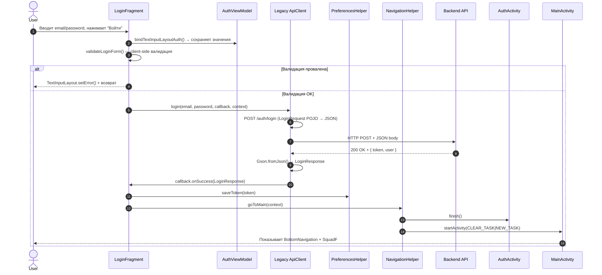
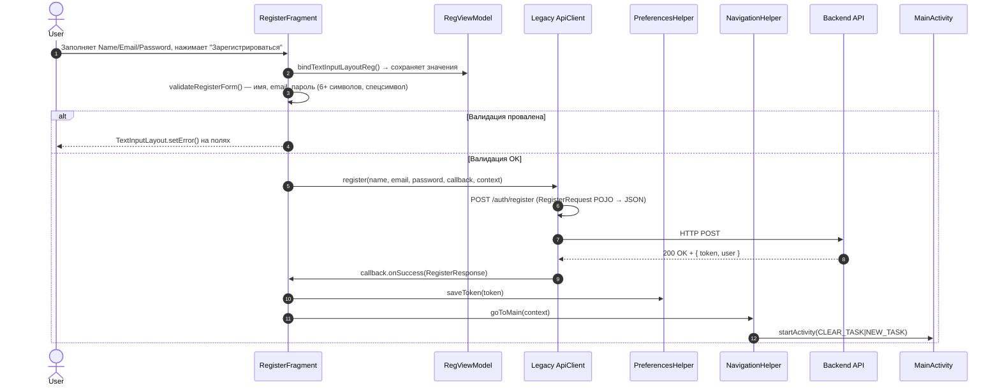
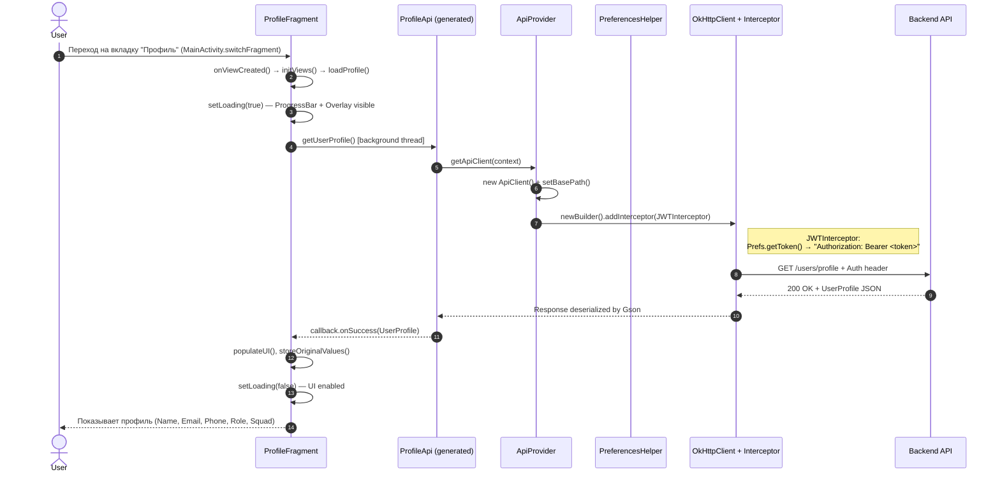
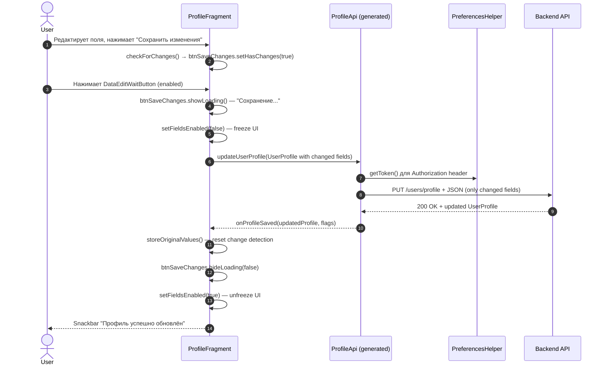
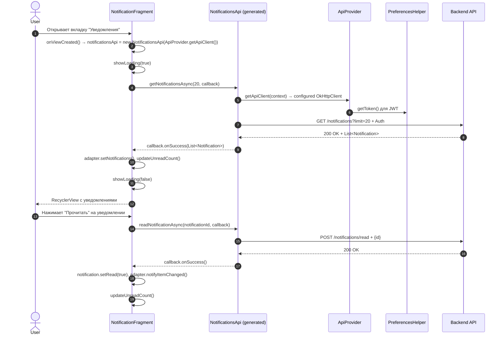
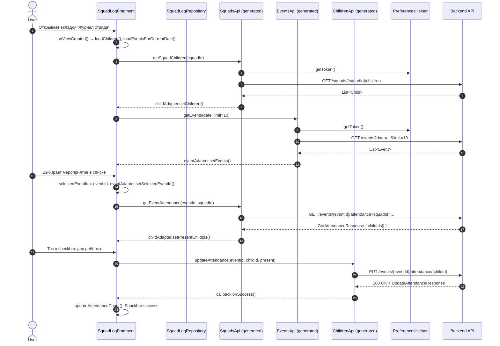
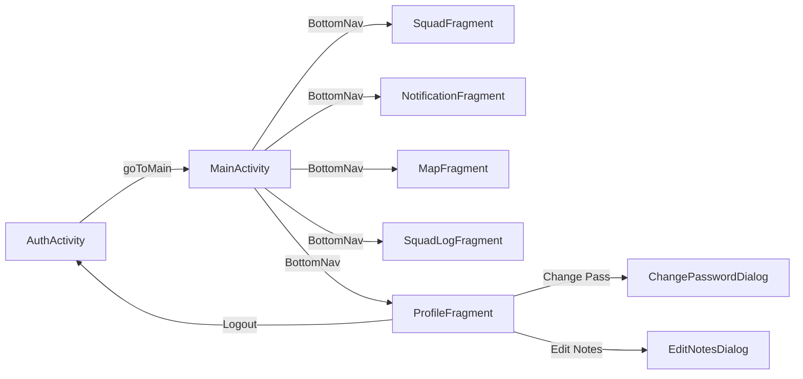

# Архитектура приложения "Лагерь-Вожатый"

> Версия документа: 2.0 | Дата: 2025-08-28  
> Проект: CAMPUS2 (Android, Java, XML)  
> Стек: Java 17, Android SDK 34, OkHttp 4.x, Gson, OpenAPI Generator 7.10, Material Components 1.12, CircleImageView 3.1.0

---

## 1. Пользовательский интерфейс (UI Flow)

*Описание: Как пользователь переходит между экранами. Только пользовательские сценарии — без технических деталей.*

```mermaid
graph TD
    %% Entry point
    Start([App Launch]) --> AuthCheck{Token in<br/>SharedPreferences?}
    
    %% Auth Flow
    AuthCheck -- No --> AuthActivity[AuthActivity]
    AuthActivity --> LoginFragment[LoginFragment<br/>"Вход"]
    AuthActivity --> RegisterFragment[RegisterFragment<br/>"Регистрация"]
    
    LoginFragment -- "Кнопка: Регистрация" --> RegisterFragment
    RegisterFragment -- "Кнопка: Вход" --> LoginFragment
    
    LoginFragment -- "Успешный вход" --> MainActivity[MainActivity]
    RegisterFragment -- "Успешная регистрация" --> MainActivity
    
    AuthCheck -- Yes --> MainActivity
    
    %% Main Navigation (Bottom Navigation)
    MainActivity --> BottomNav[BottomNavigationView]
    BottomNav --> SquadFragment[SquadFragment<br/>"Отряд"]
    BottomNav --> NotificationsFragment[NotificationsFragment<br/>"Уведомления"]
    BottomNav --> MapFragment[MapFragment<br/>"Карта"]
    BottomNav --> SquadLogFragment[SquadLogFragment<br/>"Журнал отряда"]
    BottomNav --> ProfileFragment[ProfileFragment<br/>"Профиль"]
    
    %% Profile interactions
    ProfileFragment -- "Кнопка: Сменить пароль" --> ChangePasswordDialog[ChangePasswordDialog]
    ProfileFragment -- "Кнопка: Выйти" --> AuthActivity
    ProfileFragment -- "Кнопка: Сохранить заметки" --> EditNotesDialog[Edit Notes Dialog]
    
    %% Notifications interactions
    NotificationsFragment -- "Отметить как прочитанное" --> NotificationsFragment
    NotificationsFragment -- "Прочитать все" --> NotificationsFragment
    
    %% Squad interactions
    SquadFragment -- "Поиск ребёнка" --> SquadFragment
    SquadFragment -- "Добавить ребёнка" --> AddChildDialog[Add Child Dialog]
    SquadFragment -- "Редактировать теги" --> EditTagsDialog[Edit Tags Dialog]
    
    %% Squad Log interactions
    SquadLogFragment -- "Выбрать дату" --> SquadLogFragment
    SquadLogFragment -- "Выбрать мероприятие" --> SquadLogFragment
    SquadLogFragment -- "Отметить посещаемость" --> SquadLogFragment
```

---

## 2. Потоки данных и архитектура (Data Flow)

*Описание: Как экраны общаются с сервером, что такое Repository, как обрабатываются ошибки. Два подхода: Legacy (ApiClient) для авторизации и Modern (OpenAPI) для остальных экранов.*

### 2.1. Общая схема слоёв

```mermaid
graph TB
    subgraph UI_LAYER [UI LAYER - Fragments & Activities]
        AuthF[LoginFragment / RegisterFragment]
        ProfileF[ProfileFragment]
        NotifF[NotificationFragment]
        SquadF[SquadFragment]
        SquadLogF[SquadLogFragment]
        MapF[MapFragment]
    end
    
    subgraph VM_LAYER [VIEWMODEL LAYER]
        AuthVM[AuthViewModel]
        RegVM[RegViewModel]
    end
    
    subgraph REPO_API [REPOSITORY / API LAYER]
        direction TB
        LegacyApi[LEGACY ApiClient<br/>helpers/ApiClient.java]
        ModernApi[MODERN OpenAPI Client<br/>generated/api/*]
        
        LegacyApi --> LegacyEndpoints[• login()<br/>• register()<br/>• getUser()<br/>• verifyJWT()]
        ModernApi --> ModernEndpoints[• ProfileApi<br/>• NotificationsApi<br/>• SquadsApi<br/>• ChildrenApi<br/>• EventsApi<br/>• TagsApi]
    end
    
    subgraph NETWORK [NETWORK LAYER]
        OkHttp[OkHttpClient + Interceptors]
        BaseUrl[Base URL: http://localhost:3000/api/v1]
        AuthHeader[Auth: Bearer JWT в Authorization header]
        Logging[Logging: HttpLoggingInterceptor (HEADERS)]
    end
    
    subgraph STORAGE [STORAGE LAYER]
        Prefs[PreferencesHelper<br/>SharedPreferences "AppPrefs"]
        Prefs --> JwtToken[jwt_token — Bearer токен]
        Prefs --> JesusSay[Jesus_says — Цитата для главного экрана]
        Prefs --> SquadId[squad_id — UUID текущего отряда]
        Prefs --> SquadTitle[squad_title — Название отряда]
    end
    
    AuthF --> AuthVM
    AuthVM --> LegacyApi
    ProfileF --> ModernApi
    NotifF --> ModernApi
    SquadF --> ModernApi
    SquadLogF --> ModernApi
    MapF --> ModernApi
    
    LegacyApi --> OkHttp
    ModernApi --> OkHttp
    OkHttp --> BaseUrl
    OkHttp --> AuthHeader
    OkHttp --> Logging
    
    LegacyApi --> Prefs
    ModernApi --> Prefs
```

### 2.2. Sequence Diagram: Авторизация (Legacy ApiClient)



### 2.3. Sequence Diagram: Регистрация (Legacy ApiClient)



### 2.4. Sequence Diagram: Загрузка профиля (Modern OpenAPI)



### 2.5. Sequence Diagram: Обновление профиля (Modern OpenAPI)



### 2.6. Sequence Diagram: Уведомления (Modern OpenAPI)



### 2.7. Sequence Diagram: Журнал отряда (Modern OpenAPI)



### 2.8. Обработка ошибок (Error Handling Strategy)

| Слой | Стратегия | Пример |
|------|-----------|--------|
| **Network** | Interceptor добавляет токен; при 401 — не редиректит автоматически (пусть UI решит) | `ApiProvider` interceptor логирует, но не выбрасывает исключение |
| **API Client (Legacy)** | `ApiCallback.onFailure(String errorMessage)` — единая строка для UI | `ViewUtils.toast(view, context, errorMessage)` |
| **API Client (Modern)** | `ApiCallback.onFailure(ApiException e, int statusCode, Map headers)` — полный контекст | `statusCode == 401` → `NavigationHelper.goToAuth()` |
| **UI** | Snackbar для временных ошибок; Toast для критических; инлайн ошибки для форм | `TextInputLayout.setError()` для валидации |
| **Token Expiry** | Проверка в `MainActivity.onCreate` + `AuthActivity.onCreate` через `PreferencesHelper.isTokenSet()` | При 401 в современных вызовах — `goToAuth()` |

---

## 3. Вспомогательные классы (Helpers & Utilities)

*Описание: Справочная таблица всех утилит. Это инструменты, а не бизнес-сущности.*

| Класс | Назначение | Где используется | Пример вызова | Ключевые методы |
|-------|------------|------------------|---------------|-----------------|
| **PreferencesHelper** | Абстракция над `SharedPreferences` для JWT и настроек. Хранит токен, декодирует JWT payload, сохраняет squad_id/squad_title. | `AuthActivity`, `LoginFragment`, `RegisterFragment`, `MainActivity`, `ProfileFragment`, `ApiProvider`, `Legacy ApiClient`, `SquadFragment`, `SquadLogFragment`, `NotificationFragment` | `new PreferencesHelper(context).saveToken(token)`<br/>`prefs.getToken()`<br/>`prefs.decodePayload()` → `JSONObject` | `saveToken(String)`<br/>`getToken(): String`<br/>`isTokenSet(): Boolean`<br/>`clear()`<br/>`decodePayload(): JSONObject`<br/>`saveJesusSaying(String)` / `getJesusSaying()`<br/>`saveSquadId(UUID)` / `getSquadId(): UUID`<br/>`saveSquadTitle(String)` / `getSquadTitle(): String` |
| **ViewUtils** | UI-утилиты: Snackbar с логотипом, биндинг TextInputLayout→ViewModel (auth/reg), скругление кнопок, цвет фона, dp→px конвертер. | `LoginFragment`, `RegisterFragment`, `ProfileFragment`, `NotificationFragment`, `SquadFragment`, `SquadLogFragment`, все фрагменты | `ViewUtils.showSnackbar(view, "Текст")`<br/>`ViewUtils.bindTextInputLayoutAuth(layout, viewModel, "email")`<br/>`ViewUtils.setButtonCornerRadius(btn, 14)`<br/>`ViewUtils.setBGColor(view, Color.WHITE)`<br/>`ViewUtils.dpToPx(16)` | `showSnackbar(View, String)`<br/>`toast(View, Context, String)` (deprecated, использует Snackbar)<br/>`setButtonCornerRadius(MaterialButton, float)`<br/>`setBGColor(View, int)`<br/>`bindTextInputLayoutAuth(TextInputLayout, AuthViewModel, String)`<br/>`bindTextInputLayoutReg(TextInputLayout, RegViewModel, String)`<br/>`dpToPx(float): int` |
| **NavigationHelper** | Навигация между Activity с очисткой бэк-стека (FLAG_ACTIVITY_CLEAR_TASK \| NEW_TASK). | `LoginFragment`, `RegisterFragment`, `ProfileFragment`, `MainActivity`, `AuthActivity` | `NavigationHelper.goToMain(context)`<br/>`NavigationHelper.goToAuth(context)` | `goToMain(Context)` — запускает `MainActivity`<br/>`goToAuth(Context)` — запускает `AuthActivity` |
| **ApiProvider** | Фабрика для современного OpenAPI клиента. Создаёт `ApiClient` с базовым URL и JWT-интерцептором. Одиночка (singleton). | `ProfileFragment`, `NotificationFragment`, `SquadFragment`, `SquadLogFragment`, `MapFragment` | `ApiProvider.getApiClient(context)` → `ApiClient`<br/>`new ProfileApi(ApiProvider.getApiClient(context))` | `getApiClient(Context): ApiClient`<br/>`initialize(Context)` — явная инициализация |
| **AuthViewModel** | ViewModel для сохранения ввода полей LoginFragment при смене конфигурации (rotation). | `LoginFragment` | `new ViewModelProvider(requireActivity()).get(AuthViewModel.class)` | `getEmail(): MutableLiveData<String>`<br/>`getPassword(): MutableLiveData<String>` |
| **RegViewModel** | ViewModel для сохранения ввода полей RegisterFragment (name, email, password). | `RegisterFragment` | `new ViewModelProvider(requireActivity()).get(RegViewModel.class)` | `getName(): MutableLiveData<String>`<br/>`getEmail(): MutableLiveData<String>`<br/>`getPassword(): MutableLiveData<String>` |
| **DataEditWaitButton** | Кастомный MaterialButton: disabled (серый) пока нет изменений, enabled (цветной) при изменениях, состояние загрузки "Сохранение...". | `ProfileFragment`, `SquadFragment` | `btnSaveChanges.setHasChanges(true)`<br/>`btnSaveChanges.showLoading()`<br/>`btnSaveChanges.hideLoading(false)` | `setHasChanges(boolean)`<br/>`hasChanges(): boolean`<br/>`showLoading()`<br/>`hideLoading(boolean hasChanges)`<br/>`reset()` |
| **PhoneTextWatcher** | TextWatcher для форматирования телефона по маске +7 (xxx) xxx-xx-xx при вводе. | `ProfileFragment` | `etPhone.addTextChangedListener(new PhoneTextWatcher(etPhone))` | Реализует `TextWatcher`, форматирует на лету |

---

## 4. Сравнение подходов: Legacy vs Modern API

| Характеристика | Legacy (ApiClient) | Modern (OpenAPI Generated) |
|----------------|-------------------|---------------------------|
| **Файлы** | `helpers/ApiClient.java`, POJO в `models/` | `generated/api/*Api.java`, `generated/model/*` |
| **Авторизация** | `login()`, `register()`, `verifyJWT()`, `getUser()` | Только через `AuthApi` (не используется в UI) |
| **Модели данных** | Ручные POJO (`LoginRequest`, `RegisterResponse`, `User`) | Автогенерированные из swagger.yaml |
| **Асинхронность** | `enqueue()` + callback на главном потоке | `...Async()` методы + callback |
| **Использование** | **Auth**: Login, Register, Verify JWT, GetUser (by ID from JWT) | **Всё остальное**: Profile, Notifications, Squads, Children, Events, Tags, Map |
| **Статус** | Deprecated для новых экранов; поддерживается для совместимости | Основной путь развития |

> **Миграция**: Новые экраны (`SquadFragment`, `MapFragment`, `SquadLogFragment`) должны использовать Modern подход через `ApiProvider` + соответствующий `*Api` интерфейс.

---

## 5. Зависимости и конфигурация (build.gradle.kts — ключевые части)

```kotlin
dependencies {
    // Network
    implementation("com.squareup.okhttp3:okhttp:4.12.0")
    implementation("com.squareup.okhttp3:logging-interceptor:4.12.0")
    implementation("com.google.code.gson:gson:2.10.1")
    
    // UI
    implementation("com.google.android.material:material:1.12.0")
    implementation("androidx.constraintlayout:constraintlayout:2.1.4")
    implementation("de.hdodenhof:circleimageview:3.1.0") // Avatar в Profile
    
    // Lifecycle / ViewModel
    implementation("androidx.lifecycle:lifecycle-viewmodel:2.7.0")
    implementation("androidx.lifecycle:lifecycle-livedata:2.7.0")
    implementation("androidx.fragment:fragment:1.6.2")
    
    // OpenAPI Generator (Gradle plugin)
    // id("org.openapi.generator") version "7.10.0" в plugins {}
}

// openApiGenerate задача генерирует:
// - generated/api/*Api.java (интерфейсы: ProfileApi, NotificationsApi, SquadsApi, ChildrenApi, EventsApi, TagsApi, AuthApi)
// - generated/model/* (модели данных: UserProfile, Notification, Child, Event, ChildTag, ...)
// - generated/invoker/ApiClient.java (базовый клиент), Configuration, ApiException, auth/*
```

---

## 6. OpenAPI Endpoints Mapping (swagger.yaml → Generated Code)

| Tag (swagger) | Endpoint | Generated API | Model | Fragment |
|---------------|----------|---------------|-------|----------|
| `auth` | `POST /auth/login` | `AuthApi.loginUser()` | `LoginRequest`, `AuthResponse` | — (Legacy) |
| `auth` | `POST /auth/register` | `AuthApi.registerUser()` | `RegisterRequest`, `AuthResponse` | — (Legacy) |
| `auth` | `GET /auth/verify-jwt` | `AuthApi.verifyJwt()` | `VerifyJWTResponse` | — (Legacy) |
| `profile` | `GET /users/profile` | `ProfileApi.getUserProfile()` | `UserProfile` | `ProfileFragment` |
| `profile` | `PUT /users/profile` | `ProfileApi.updateUserProfile()` | `UserProfile` | `ProfileFragment` |
| `squads` | `GET /squads/{squadId}/children` | `SquadsApi.getSquadChildren()` | `Child`, `ChildTag` | `SquadFragment` (planned) |
| `squads` | `GET /events/{eventId}/attendance` | `SquadsApi.getEventAttendance()` | `GetAttendanceResponse` | `SquadLogFragment` |
| `notifications` | `GET /notifications` | `NotificationsApi.getNotifications()` | `Notification` | `NotificationFragment` |
| `notifications` | `POST /notifications/read` | `NotificationsApi.readNotification()` | `ReadNotificationRequest/Response` | `NotificationFragment` |
| `notifications` | `POST /notifications/read-all` | `NotificationsApi.readAllNotifications()` | `ReadAllNotifications200Response` | `NotificationFragment` |
| `events` | `GET /events` | `EventsApi.getEvents()` | `Event` | `MapFragment` (planned), `SquadLogFragment` |
| `events` | `PUT /events/{eventId}/attendance/{childId}` | `ChildrenApi.updateEventAttendance()` | `UpdateAttendanceResponse` | `SquadLogFragment` |
| `tags` | `GET /tags` | `TagsApi.getTags()` | `ChildTag` | `SquadFragment` (теги детей) |

---

## 7. Основные экраны и их состояния (State Matrix)

### 7.1. LoginFragment / RegisterFragment (AuthActivity)

| Состояние | Описание | UI |
|-----------|----------|-----|
| **Initial** | Пустые поля, кнопка входа/регистрации активна | TextInputLayout без ошибок |
| **Validating** | Пользователь вводит данные | Реал-тайм валидация: setError() на полях |
| **Loading** | Запрос к серверу | ViewUtils.showSnackbar не показывается, кнопка может быть disabled |
| **Error** | Неверные креды / сеть | Snackbar с ошибкой, поля сохраняют ввод |
| **Success** | Токен получен | NavigationHelper.goToMain() |

### 7.2. ProfileFragment

| Состояние | Описание | UI |
|-----------|----------|-----|
| **Loading** | Загрузка профиля | ProgressBar + Overlay (clickable), поля disabled |
| **Loaded** | Данные получены | Поля заполнены, btnSaveChanges disabled (серый) |
| **Editing** | Пользователь меняет поля | btnSaveChanges enabled (цветной) |
| **Validation Error** | Неверный email/phone | TextInputLayout.setError() |
| **Saving** | Отправка на сервер | btnSaveChanges: "Сохранение...", disabled, поля frozen |
| **Saved** | Успешный ответ | Snackbar успех, btnSaveChanges reset к disabled |
| **Save Error** | Ошибка сервера | Snackbar ошибка, btnSaveChanges hideLoading(true), поля unfreeze |
| **Token Expired** | 401 при загрузке | logout() → AuthActivity |

### 7.3. NotificationFragment

| Состояние | Описание | UI |
|-----------|----------|-----|
| **Loading** | Загрузка списка | ProgressBar + Overlay |
| **Loaded (data)** | Уведомления есть | RecyclerView, header с unread count, кнопка "Прочитать все" если есть непрочитанные |
| **Loaded (empty)** | Уведомлений нет | Empty state text "Уведомлений нет" |
| **Error** | Ошибка загрузки | Snackbar, retry при pull-to-refresh (если реализовано) |
| **Marking Read** | Отметка одного | Item обновляется: фон становится белым, unread count -1 |
| **Read All** | Массовая отметка | Все items обновляются, кнопка "Прочитать все" скрывается |

### 7.4. SquadLogFragment

| Состояние | Описание | UI |
|-----------|----------|-----|
| **Loading** | Загрузка детей/мероприятий | ProgressBar + Overlay |
| **Date Selected** | Выбрана дата | DatePicker показывает дату, список мероприятий для даты |
| **Event Selected** | Выбрано мероприятие | Event подсвечен, дети с checkboxes (green=present, red=absent) |
| **No Event Selected** | Мероприятие не выбрано | Дети без checkboxes, attendance count = "Мероприятие не выбрано" |
| **Marking Attendance** | Тоггл checkbox | Checkbox заморожен до ответа сервера |
| **Error** | Ошибка отметки | Checkbox ревертится, Snackbar ошибка |

---

## 8. Известные проблемы и технический долг

1. **`ApiClient.isTokenValid()`** — асинхронный вызов, но возвращает `boolean` синхронно (всегда `false`). Закомментирован в `AuthActivity` и `MainActivity`.
2. **Два способа хранения токена**: `PreferencesHelper` (новый) и прямой доступ к `SharedPreferences` в старом `ApiClient.getClient()`. Нужно унифицировать.
3. **`DataEditWaitButton`** — кастомная вью в `profile` пакете, должна быть вынесена в `ui/common` или `widgets`.
4. **SquadFragment, MapFragment** — частично реализованы (SquadLogFragment готов).
5. **Pull-to-refresh** — не реализован в `NotificationFragment`, `SquadFragment`.
6. **Офлайн-режим** — нет кэширования ответов (Room/SharedPreferences для офлайн-поддержки).
7. **JWT Refresh** — нет автоматического рефреша access token (backend должен поддерживать refresh token).
8. **Hardcoded Base URL** — в `ApiClient.BASE_URL` и `ApiProvider` (buildConfigField или gradle property).
9. **Test Coverage** — нет unit/UI тестов (Espresso, JUnit, MockWebServer).

---

## 9. Навигация и Deep Links (планируется)



**Deep Links (planned):**
- `campus://profile` → ProfileFragment
- `campus://notifications` → NotificationFragment
- `campus://squad/{squadId}` → SquadFragment
- `campus://squad-log?date=YYYY-MM-DD` → SquadLogFragment с датой

---

*Документ актуален на commit: `HEAD` | Последнее обновление: 2025-08-28*